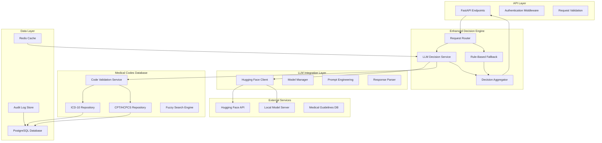

# Design Document - LLM-Enhanced Decision Engine

## Overview

This design document outlines the architecture and implementation approach for Phase 2 of the Prior Authorization Agent, which integrates Large Language Models (LLMs) from Hugging Face as the core decision-making engine and implements a comprehensive medical codes database. The enhanced system will transform the current rule-based approach into an AI-powered medical reasoning system while maintaining HIPAA compliance, auditability, and high performance.

The design leverages healthcare-specific models like Microsoft's BiomedNLP-PubMedBERT and clinical BERT variants to provide context-aware medical decision-making, combined with a robust medical codes database for ICD-10 and CPT code validation and management.

## Architecture

### High-Level Architecture



### Component Architecture

The system is designed with a modular architecture that allows for independent scaling and maintenance of different components:

1. **LLM Decision Service**: Core AI reasoning engine
2. **Medical Codes Database**: Comprehensive code validation and management
3. **Hybrid Decision Engine**: Combines AI and rule-based approaches
4. **Performance Optimization Layer**: Caching and request optimization

## Components and Interfaces

### 1. LLM Integration Service

**Purpose**: Manages communication with Hugging Face models and local model servers.

**Key Components**:
- **Model Manager**: Handles model selection, loading, and lifecycle management
- **Prompt Engineering Engine**: Constructs medical context-aware prompts
- **Response Parser**: Extracts structured decisions from LLM responses
- **Fallback Handler**: Manages graceful degradation when LLMs are unavailable

**Interface**:
```python
class LLMDecisionService:
    async def make_decision(
        self, 
        request: AuthorizationRequest,
        medical_context: MedicalContext,
        policy_context: PolicyContext
    ) -> LLMDecisionResponse
    
    async def validate_medical_reasoning(
        self,
        decision: LLMDecisionResponse
    ) -> ValidationResult
    
    async def get_model_health(self) -> ModelHealthStatus
```

**Model Selection Strategy**:
- **Primary**: Microsoft BiomedNLP-PubMedBERT for medical text understanding
- **Secondary**: Clinical BERT variants for specialized medical reasoning
- **Fallback**: Lighter models for high-volume scenarios
- **Local Option**: Support for on-premises deployment for sensitive data

### 2. Medical Codes Database Service

**Purpose**: Provides comprehensive medical code validation, search, and management capabilities.

**Database Schema**:
```sql
-- ICD-10 Codes Table
CREATE TABLE icd10_codes (
    id SERIAL PRIMARY KEY,
    code VARCHAR(10) NOT NULL UNIQUE,
    description TEXT NOT NULL,
    category VARCHAR(50),
    subcategory VARCHAR(100),
    valid_from DATE NOT NULL,
    valid_to DATE,
    billable BOOLEAN DEFAULT true,
    gender_specific CHAR(1),
    age_restrictions JSONB,
    created_at TIMESTAMP DEFAULT NOW(),
    updated_at TIMESTAMP DEFAULT NOW()
);

-- CPT/HCPCS Codes Table
CREATE TABLE cpt_codes (
    id SERIAL PRIMARY KEY,
    code VARCHAR(10) NOT NULL UNIQUE,
    description TEXT NOT NULL,
    category VARCHAR(50),
    modifier_allowed BOOLEAN DEFAULT true,
    bilateral_surgery BOOLEAN DEFAULT false,
    assistant_surgery BOOLEAN DEFAULT false,
    valid_from DATE NOT NULL,
    valid_to DATE,
    relative_value_units DECIMAL(6,2),
    created_at TIMESTAMP DEFAULT NOW(),
    updated_at TIMESTAMP DEFAULT NOW()
);

-- Code Relationships Table
CREATE TABLE code_relationships (
    id SERIAL PRIMARY KEY,
    primary_code VARCHAR(10) NOT NULL,
    related_code VARCHAR(10) NOT NULL,
    relationship_type VARCHAR(50), -- 'contraindicated', 'recommended', 'alternative'
    strength DECIMAL(3,2), -- 0.0 to 1.0
    created_at TIMESTAMP DEFAULT NOW()
);
```

**Interface**:
```python
class MedicalCodesService:
    async def validate_icd10_code(self, code: str) -> CodeValidationResult
    async def validate_cpt_code(self, code: str) -> CodeValidationResult
    async def search_codes(self, query: str, code_type: str) -> List[CodeSearchResult]
    async def get_code_suggestions(self, partial_code: str) -> List[CodeSuggestion]
    async def bulk_import_codes(self, codes_data: List[Dict]) -> ImportResult
    async def get_code_relationships(self, code: str) -> List[CodeRelationship]
```

### 3. Enhanced Decision Engine

**Purpose**: Orchestrates the decision-making process using both LLM and rule-based approaches.

**Decision Flow**:
1. **Request Analysis**: Parse and validate incoming authorization request
2. **Medical Code Validation**: Validate all ICD-10 and CPT codes
3. **Context Building**: Gather medical history, policy rules, and clinical guidelines
4. **LLM Processing**: Send structured prompt to selected medical LLM
5. **Response Validation**: Validate LLM response against business rules
6. **Confidence Assessment**: Calculate decision confidence score
7. **Fallback Logic**: Use rule-based engine if LLM confidence is low
8. **Decision Finalization**: Generate final decision with reasoning

**Interface**:
```python
class EnhancedDecisionEngine:
    async def process_authorization_request(
        self,
        request: AuthorizationRequest
    ) -> EnhancedDecisionResponse
    
    async def explain_decision(
        self,
        decision_id: str
    ) -> DecisionExplanation
    
    async def get_alternative_recommendations(
        self,
        request: AuthorizationRequest
    ) -> List[AlternativeRecommendation]
```

### 4. Prompt Engineering System

**Purpose**: Constructs medical context-aware prompts for optimal LLM performance.

**Prompt Template Structure**:
```python
MEDICAL_DECISION_PROMPT = """
You are a medical AI assistant specializing in prior authorization decisions for healthcare procedures.

PATIENT CONTEXT:
- Age: {patient_age}
- Gender: {patient_gender}
- Primary Diagnosis: {primary_diagnosis} ({icd10_code})
- Comorbidities: {comorbidities}
- Previous Treatments: {treatment_history}

REQUESTED PROCEDURE:
- Procedure: {procedure_name}
- CPT Code: {cpt_code}
- Urgency: {urgency_level}
- Provider Justification: {clinical_justification}

POLICY CONTEXT:
- Payer Guidelines: {payer_policies}
- Medical Necessity Criteria: {necessity_criteria}
- Coverage Limitations: {coverage_limits}

CLINICAL GUIDELINES:
{relevant_clinical_guidelines}

Please analyze this prior authorization request and provide:
1. DECISION: Approve/Deny/Pending (require more information)
2. MEDICAL_REASONING: Detailed clinical justification
3. CONFIDENCE_SCORE: 0.0-1.0 confidence in decision
4. REQUIRED_DOCUMENTATION: Any additional documentation needed
5. ALTERNATIVE_PROCEDURES: Suggested alternatives if denied

Format your response as JSON with the above fields.
"""
```

## Data Models

### Enhanced Authorization Request
```python
@dataclass
class EnhancedAuthorizationRequest:
    request_id: str
    patient_info: PatientInfo
    provider_info: ProviderInfo
    procedure_info: ProcedureInfo
    clinical_context: ClinicalContext
    policy_context: PolicyContext
    timestamp: datetime
    
@dataclass
class ClinicalContext:
    primary_diagnosis: DiagnosisInfo
    secondary_diagnoses: List[DiagnosisInfo]
    treatment_history: List[TreatmentRecord]
    lab_results: Optional[List[LabResult]]
    imaging_results: Optional[List[ImagingResult]]
    clinical_notes: Optional[str]
    
@dataclass
class DiagnosisInfo:
    icd10_code: str
    description: str
    onset_date: Optional[date]
    severity: Optional[str]
    status: str  # active, resolved, chronic
```

### LLM Decision Response
```python
@dataclass
class LLMDecisionResponse:
    decision: DecisionType  # APPROVE, DENY, PENDING
    confidence_score: float
    medical_reasoning: str
    policy_compliance: PolicyComplianceResult
    required_documentation: List[str]
    alternative_procedures: List[AlternativeProcedure]
    risk_factors: List[RiskFactor]
    contraindications: List[str]
    model_used: str
    processing_time: float
    
@dataclass
class PolicyComplianceResult:
    compliant: bool
    violated_policies: List[str]
    compliance_score: float
    policy_references: List[str]
```

### Medical Code Models
```python
@dataclass
class ICD10Code:
    code: str
    description: str
    category: str
    subcategory: str
    billable: bool
    valid_from: date
    valid_to: Optional[date]
    gender_specific: Optional[str]
    age_restrictions: Optional[Dict]
    
@dataclass
class CPTCode:
    code: str
    description: str
    category: str
    modifier_allowed: bool
    bilateral_surgery: bool
    relative_value_units: float
    valid_from: date
    valid_to: Optional[date]
```

## Error Handling

### LLM Error Handling Strategy

1. **Model Unavailability**:
   - Automatic fallback to secondary models
   - Graceful degradation to rule-based engine
   - Queue requests for retry when models recover

2. **Invalid Responses**:
   - Response validation against expected schema
   - Confidence threshold enforcement
   - Human review escalation for low-confidence decisions

3. **Performance Issues**:
   - Request timeout handling (30-second limit)
   - Circuit breaker pattern for failing models
   - Load balancing across multiple model instances

### Medical Codes Error Handling

1. **Invalid Codes**:
   - Fuzzy matching for typos and variations
   - Suggestion engine for similar codes
   - Historical code mapping for deprecated codes

2. **Database Issues**:
   - Cached code validation for offline scenarios
   - Periodic code database synchronization
   - Backup validation using external APIs

## Testing Strategy

### LLM Testing Approach

1. **Model Performance Testing**:
   - Benchmark against known medical scenarios
   - A/B testing between different models
   - Accuracy measurement against expert decisions

2. **Prompt Engineering Testing**:
   - Systematic prompt variation testing
   - Medical scenario coverage validation
   - Edge case handling verification

3. **Integration Testing**:
   - End-to-end decision flow testing
   - Fallback mechanism validation
   - Performance under load testing

### Medical Codes Testing

1. **Data Integrity Testing**:
   - Code validation accuracy testing
   - Search functionality performance testing
   - Bulk import/export testing

2. **API Testing**:
   - Code lookup performance testing
   - Fuzzy search accuracy testing
   - Concurrent access testing

### Security and Compliance Testing

1. **HIPAA Compliance Testing**:
   - PHI de-identification validation
   - Audit trail completeness testing
   - Access control enforcement testing

2. **Data Security Testing**:
   - Encryption validation (at rest and in transit)
   - API security testing
   - Penetration testing for LLM endpoints

## Performance Considerations

### LLM Performance Optimization

1. **Caching Strategy**:
   - Similar request caching using semantic similarity
   - Model response caching for identical inputs
   - Precomputed decisions for common scenarios

2. **Model Selection Optimization**:
   - Dynamic model selection based on request complexity
   - Load balancing across multiple model instances
   - Cost optimization through model tier selection

3. **Parallel Processing**:
   - Asynchronous LLM calls for multiple requests
   - Batch processing for similar requests
   - Pipeline optimization for decision flow

### Database Performance

1. **Medical Codes Database**:
   - Indexed searches on code and description fields
   - Full-text search optimization
   - Connection pooling for high concurrency

2. **Caching Layer**:
   - Redis caching for frequently accessed codes
   - In-memory caching for validation results
   - Cache invalidation strategies for code updates

## Security and Compliance

### HIPAA Compliance for LLM Processing

1. **Data De-identification**:
   - Automatic PHI removal before LLM processing
   - Safe Harbor method implementation
   - Expert determination for complex cases

2. **Business Associate Agreements**:
   - BAA establishment with Hugging Face
   - Data processing agreement compliance
   - Audit rights and breach notification procedures

3. **On-Premises Option**:
   - Local model deployment capability
   - Air-gapped processing for sensitive data
   - Complete data sovereignty maintenance

### Audit and Monitoring

1. **Decision Audit Trail**:
   - Complete LLM interaction logging
   - Model version and configuration tracking
   - Decision reasoning preservation

2. **Performance Monitoring**:
   - Real-time model performance metrics
   - Decision accuracy tracking
   - System health monitoring

3. **Compliance Reporting**:
   - Automated compliance report generation
   - Decision pattern analysis
   - Regulatory requirement tracking