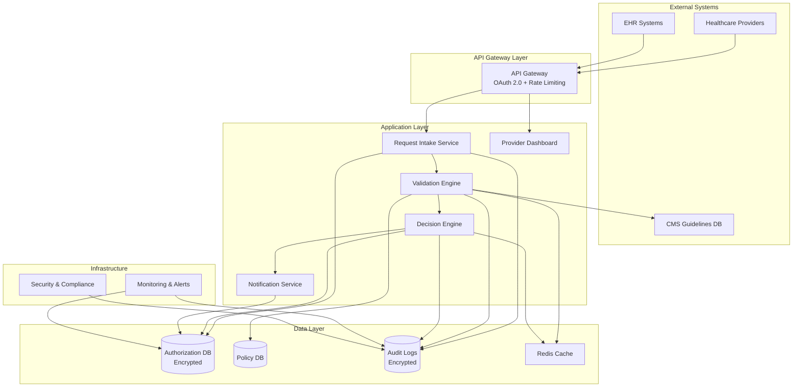

# Design Document

## Overview

The Prior Authorization Agent is a Python-based intelligent healthcare automation system that processes prior authorization requests for outpatient imaging services. The system follows a modular, microservices-inspired architecture with clear separation of concerns, ensuring HIPAA compliance, scalability, and extensibility for future healthcare services.

The system processes structured requests from healthcare providers, validates them against payer policies and CMS guidelines, and generates real-time authorization decisions with comprehensive audit logging.

## Architecture

### High-Level Architecture



### System Components

#### 1. API Gateway Layer
- **Purpose**: Single entry point for all external requests
- **Technology**: Python FastAPI with OAuth 2.0 authentication
- **Responsibilities**:
  - Request authentication and authorization
  - Rate limiting and throttling
  - Request routing and load balancing
  - TLS 1.3 termination

#### 2. Request Intake Service
- **Purpose**: Process and validate incoming authorization requests
- **Technology**: Python with Pydantic for data validation
- **Responsibilities**:
  - Request format validation
  - Medical code validation (ICD-10, CPT/HCPCS)
  - Data sanitization and PHI handling
  - Request tracking ID generation

#### 3. Validation Engine
- **Purpose**: Validate requests against coverage policies and medical necessity
- **Technology**: Python with rule engine framework
- **Responsibilities**:
  - Payer policy validation
  - CMS NCD/LCD compliance checking
  - Medical necessity evaluation
  - Policy conflict resolution

#### 4. Decision Engine
- **Purpose**: Generate authorization decisions with reasoning
- **Technology**: Python with decision tree logic
- **Responsibilities**:
  - Decision generation (approve/deny/request info)
  - Reasoning documentation
  - Authorization number generation
  - Decision confidence scoring

#### 5. Notification Service
- **Purpose**: Handle real-time notifications and status updates
- **Technology**: Python with async messaging
- **Responsibilities**:
  - Email notifications
  - Dashboard alerts
  - API callbacks
  - Status tracking updates

## Components and Interfaces

### Core Data Models

#### AuthorizationRequest
```python
class AuthorizationRequest(BaseModel):
    request_id: str
    provider_id: str
    patient_demographics: PatientDemographics
    diagnosis_codes: List[ICD10Code]
    procedure_codes: List[CPTCode]
    clinical_notes: str
    urgency_level: UrgencyLevel
    submitted_at: datetime
    status: RequestStatus
```

#### PatientDemographics
```python
class PatientDemographics(BaseModel):
    patient_id: str  # Encrypted/hashed
    age: int
    gender: Gender
    insurance_id: str  # Encrypted
    member_id: str  # Encrypted
```

#### AuthorizationDecision
```python
class AuthorizationDecision(BaseModel):
    decision_id: str
    request_id: str
    status: DecisionStatus  # APPROVED, DENIED, MORE_INFO_NEEDED
    reasoning: List[str]
    policy_references: List[str]
    authorization_number: Optional[str]
    valid_until: Optional[datetime]
    confidence_score: float
    decided_at: datetime
```

### API Interfaces

#### REST API Endpoints

```python
# Request Submission
POST /api/v1/authorization/requests
Content-Type: application/json
Authorization: Bearer {token}

# Request Status Check
GET /api/v1/authorization/requests/{request_id}
Authorization: Bearer {token}

# Bulk Status Check
GET /api/v1/authorization/requests?provider_id={id}&status={status}
Authorization: Bearer {token}

# Decision Retrieval
GET /api/v1/authorization/decisions/{decision_id}
Authorization: Bearer {token}

# Provider Dashboard Data
GET /api/v1/dashboard/summary?provider_id={id}
Authorization: Bearer {token}
```

#### Internal Service Interfaces

```python
# Validation Engine Interface
class ValidationEngine:
    def validate_request(self, request: AuthorizationRequest) -> ValidationResult
    def check_coverage_policy(self, procedure_code: str, diagnosis_code: str) -> PolicyResult
    def evaluate_medical_necessity(self, clinical_notes: str, codes: List[str]) -> NecessityResult

# Decision Engine Interface
class DecisionEngine:
    def generate_decision(self, request: AuthorizationRequest, validation: ValidationResult) -> AuthorizationDecision
    def calculate_confidence(self, validation_results: List[ValidationResult]) -> float
    def generate_reasoning(self, validation: ValidationResult) -> List[str]
```

## Data Models

### Database Schema

#### Authorization Requests Table
```sql
CREATE TABLE authorization_requests (
    request_id VARCHAR(36) PRIMARY KEY,
    provider_id VARCHAR(50) NOT NULL,
    patient_demographics_encrypted TEXT NOT NULL,
    diagnosis_codes JSON NOT NULL,
    procedure_codes JSON NOT NULL,
    clinical_notes_encrypted TEXT,
    urgency_level VARCHAR(20),
    status VARCHAR(20) NOT NULL,
    submitted_at TIMESTAMP NOT NULL,
    updated_at TIMESTAMP NOT NULL,
    INDEX idx_provider_status (provider_id, status),
    INDEX idx_submitted_at (submitted_at)
);
```

#### Authorization Decisions Table
```sql
CREATE TABLE authorization_decisions (
    decision_id VARCHAR(36) PRIMARY KEY,
    request_id VARCHAR(36) NOT NULL,
    status VARCHAR(20) NOT NULL,
    reasoning JSON NOT NULL,
    policy_references JSON,
    authorization_number VARCHAR(50),
    valid_until TIMESTAMP,
    confidence_score DECIMAL(3,2),
    decided_at TIMESTAMP NOT NULL,
    FOREIGN KEY (request_id) REFERENCES authorization_requests(request_id),
    INDEX idx_request_id (request_id),
    INDEX idx_auth_number (authorization_number)
);
```

#### Coverage Policies Table
```sql
CREATE TABLE coverage_policies (
    policy_id VARCHAR(36) PRIMARY KEY,
    payer_id VARCHAR(50) NOT NULL,
    procedure_code VARCHAR(10) NOT NULL,
    diagnosis_codes JSON,
    coverage_criteria JSON NOT NULL,
    effective_date DATE NOT NULL,
    expiration_date DATE,
    policy_type VARCHAR(20) NOT NULL, -- NCD, LCD, PAYER
    is_active BOOLEAN DEFAULT TRUE,
    INDEX idx_payer_procedure (payer_id, procedure_code),
    INDEX idx_effective_date (effective_date)
);
```

### Data Encryption Strategy

#### PHI Encryption
- **Patient Demographics**: AES-256 encryption with patient-specific keys
- **Clinical Notes**: AES-256 encryption with request-specific keys
- **Insurance Information**: Tokenization with secure key management

#### Key Management
- **Encryption Keys**: Stored in AWS KMS or HashiCorp Vault
- **Key Rotation**: Automated monthly rotation
- **Access Control**: Role-based key access with audit logging

## Error Handling

### Error Classification

#### Validation Errors
```python
class ValidationError(Exception):
    def __init__(self, field: str, message: str, suggested_fix: str = None):
        self.field = field
        self.message = message
        self.suggested_fix = suggested_fix
```

#### Policy Errors
```python
class PolicyError(Exception):
    def __init__(self, policy_id: str, conflict_type: str, resolution: str):
        self.policy_id = policy_id
        self.conflict_type = conflict_type
        self.resolution = resolution
```

### Error Response Format
```json
{
    "error": {
        "code": "VALIDATION_ERROR",
        "message": "Invalid procedure code",
        "details": {
            "field": "procedure_codes[0]",
            "value": "99999",
            "suggestion": "Use CPT code 70551 for brain MRI without contrast"
        },
        "request_id": "req_123456789",
        "timestamp": "2025-01-24T10:30:00Z"
    }
}
```

### Graceful Degradation
- **Policy Service Unavailable**: Use cached policies with staleness warnings
- **CMS Service Timeout**: Apply conservative approval criteria
- **Database Connection Issues**: Queue requests for retry with user notification

## Testing Strategy

### Unit Testing
- **Coverage Target**: 90% code coverage for all business logic
- **Mock Data**: Comprehensive test datasets with various medical scenarios
- **Test Categories**:
  - Medical code validation
  - Policy evaluation logic
  - Decision generation algorithms
  - Encryption/decryption functions

### Integration Testing
- **API Testing**: Full request-response cycle testing
- **Database Testing**: Data persistence and retrieval validation
- **External Service Testing**: Mock CMS and policy service interactions
- **Security Testing**: PHI handling and encryption validation

### Performance Testing
- **Load Testing**: 1000+ concurrent requests simulation
- **Stress Testing**: System behavior under extreme load
- **Response Time Testing**: 95% of requests under 2-minute target
- **Scalability Testing**: Auto-scaling behavior validation

### Compliance Testing
- **HIPAA Compliance**: PHI handling audit
- **Security Testing**: Penetration testing and vulnerability assessment
- **Audit Trail Testing**: Complete decision traceability verification
- **Data Retention Testing**: Automated purging validation

## Security Architecture

### Authentication & Authorization
- **Provider Authentication**: OAuth 2.0 with JWT tokens
- **API Security**: Rate limiting, request signing, IP whitelisting
- **Role-Based Access**: Minimum necessary principle implementation
- **Session Management**: Secure token lifecycle management

### Data Protection
- **Encryption at Rest**: AES-256 for all PHI data
- **Encryption in Transit**: TLS 1.3 for all communications
- **Data Masking**: PHI redaction in logs and non-production environments
- **Secure Deletion**: Cryptographic erasure for data purging

### Monitoring & Alerting
- **Security Events**: Real-time alerts for unauthorized access attempts
- **Anomaly Detection**: Unusual request patterns and decision outcomes
- **Compliance Monitoring**: Automated HIPAA compliance checking
- **Incident Response**: Automated security incident workflows

## Deployment Architecture

### Infrastructure Components
- **Application Servers**: Auto-scaling Python application instances
- **Database**: Encrypted MySQL cluster with read replicas
- **Cache Layer**: Redis cluster for policy and decision caching
- **Message Queue**: RabbitMQ for asynchronous processing
- **Load Balancer**: NGINX with SSL termination

### Scalability Design
- **Horizontal Scaling**: Stateless application design for easy scaling
- **Database Sharding**: Request data partitioned by provider or date
- **Caching Strategy**: Multi-level caching for policies and decisions
- **Async Processing**: Non-blocking decision generation pipeline

### Monitoring & Observability
- **Application Metrics**: Request volume, response times, error rates
- **Business Metrics**: Approval rates, processing times, policy hit rates
- **Infrastructure Metrics**: CPU, memory, database performance
- **Audit Metrics**: Compliance violations, security events, data access patterns