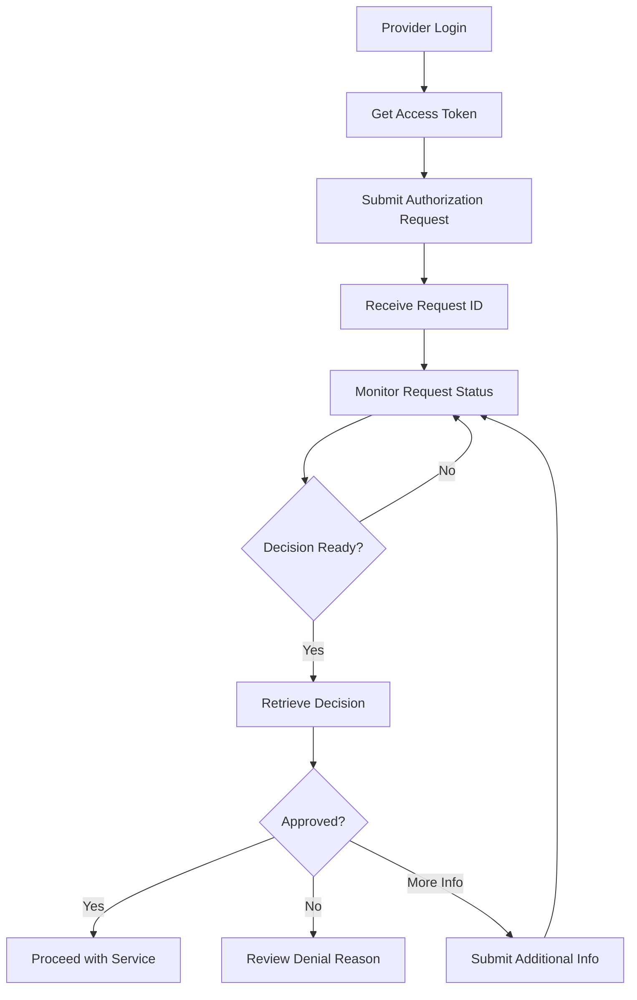

# Prior Authorization Agent - User Guide

## 📋 Overview

The Prior Authorization Agent is an intelligent healthcare automation system that processes prior authorization requests for outpatient imaging services (MRI, CT scans, X-rays) for US-based healthcare payers.

### Key Features
- ✅ Automated prior authorization workflow processing
- ✅ Real-time validation against coverage policies and CMS guidelines
- ✅ HIPAA-compliant data handling with AES-256 encryption
- ✅ Comprehensive audit logging and compliance reporting
- ✅ RESTful API with OAuth 2.0 authentication
- ✅ High-performance processing (95% of requests under 2 minutes)
- ✅ Scalable architecture supporting 1000+ concurrent requests

---

## 🚀 Quick Start

### Prerequisites
- Python 3.11 or higher
- Virtual environment activated
- Application running on `http://127.0.0.1:8000`

### Start the Application
```bash
# Navigate to project directory
cd /path/to/prior-authorization-agent

# Activate virtual environment
source venv/bin/activate

# Start the server
python -m src.main
```

### Verify System Health
```bash
curl http://127.0.0.1:8000/api/v1/health
```

---

## 👥 User Roles & Test Accounts

| Username | Password | Role | Description |
|----------|----------|------|-------------|
| `provider1` | `provider123` | Healthcare Provider | Submit and track authorization requests |
| `admin1` | `admin123` | Payer Administrator | Manage policies and review decisions |
| `compliance1` | `compliance123` | Compliance Officer | Monitor audit logs and compliance |

---

## 🔐 Authentication

### Method 1: Form-based Login
```bash
curl -X POST "http://127.0.0.1:8000/api/v1/auth/login" \
  -H "Content-Type: application/x-www-form-urlencoded" \
  -d "username=provider1&password=provider123"
```

### Method 2: JSON Login
```bash
curl -X POST "http://127.0.0.1:8000/api/v1/auth/login-json" \
  -H "Content-Type: application/json" \
  -d '{"username": "provider1", "password": "provider123"}'
```

### Response Format
```json
{
  "access_token": "eyJhbGciOiJIUzI1NiIsInR5cCI6IkpXVCJ9...",
  "token_type": "bearer",
  "expires_in": 86400,
  "scope": null
}
```

**💡 Important:** Save the `access_token` for all subsequent API calls.

---

## 📝 Submit Authorization Request

### Sample Request Structure
```json
{
  "request_id": "req_2024_001234",
  "provider_id": "prov_12345",
  "patient_demographics": {
    "patient_id": "enc_pat_1a2b3c4d5e6f7g8h",
    "age": 45,
    "gender": "female",
    "insurance_id": "enc_ins_9z8y7x6w5v4u3t2s",
    "member_id": "enc_mem_a1b2c3d4e5f6g7h8"
  },
  "diagnosis_codes": [
    {
      "code": "M25.511",
      "description": "Pain in right shoulder",
      "category": "musculoskeletal"
    }
  ],
  "procedure_codes": [
    {
      "code": "73221",
      "description": "MRI upper extremity without contrast",
      "category": "radiology"
    }
  ],
  "clinical_notes": "Patient presents with chronic right shoulder pain lasting 6 months. Conservative treatment with physical therapy has failed. MRI needed to evaluate for rotator cuff tear.",
  "procedure_type": "mri",
  "urgency_level": "routine"
}
```

### Submit Request
```bash
# Get authentication token
TOKEN=$(curl -s -X POST "http://127.0.0.1:8000/api/v1/auth/login" \
  -H "Content-Type: application/x-www-form-urlencoded" \
  -d "username=provider1&password=provider123" | \
  python -c "import sys, json; print(json.load(sys.stdin)['access_token'])")

# Submit authorization request
curl -X POST "http://127.0.0.1:8000/api/v1/authorization/requests" \
  -H "Authorization: Bearer $TOKEN" \
  -H "Content-Type: application/json" \
  -d @sample_request.json
```

### Expected Response
```json
{
  "request_id": "req_2025_732009",
  "status": "submitted",
  "message": "Authorization request submitted successfully",
  "timestamp": "2025-07-28T04:42:11.715703Z",
  "validation_warnings": null
}
```

---

## 📊 Track Request Status

### Check Individual Request
```bash
curl -X GET "http://127.0.0.1:8000/api/v1/authorization/requests/{request_id}" \
  -H "Authorization: Bearer $TOKEN"
```

### Response Format
```json
{
  "request_id": "req_2025_732009",
  "status": "submitted",
  "submitted_at": "2025-07-28T04:42:11.715703Z",
  "updated_at": "2025-07-28T04:42:27.393283Z",
  "estimated_completion": "2025-07-28T06:42:11.715703Z",
  "current_stage": "Initial Review",
  "progress_percentage": 10,
  "next_actions": [
    "Awaiting medical code validation",
    "Awaiting policy review"
  ]
}
```

### Request Status Values
- `submitted` - Request received and queued
- `in_review` - Under medical necessity review
- `approved` - Authorization granted
- `denied` - Authorization denied
- `more_info_needed` - Additional information required

---

## 📋 Provider Dashboard

### Dashboard Summary
```bash
curl -X GET "http://127.0.0.1:8000/api/v1/dashboard/summary/{provider_id}" \
  -H "Authorization: Bearer $TOKEN"
```

### List All Requests
```bash
curl -X GET "http://127.0.0.1:8000/api/v1/dashboard/requests/{provider_id}" \
  -H "Authorization: Bearer $TOKEN"
```

### Activity Metrics
```bash
curl -X GET "http://127.0.0.1:8000/api/v1/dashboard/metrics/{provider_id}" \
  -H "Authorization: Bearer $TOKEN"
```

---

## 🎯 Authorization Decisions

### Get Decision by Request ID
```bash
curl -X GET "http://127.0.0.1:8000/api/v1/decisions/request/{request_id}" \
  -H "Authorization: Bearer $TOKEN"
```

### Decision Response Format
```json
{
  "decision_id": "dec_2024_001234",
  "request_id": "req_2024_001234",
  "status": "approved",
  "reasoning": [
    "Medical necessity criteria met per CMS NCD 220.2",
    "ICD-10 code M25.511 supports requested MRI procedure",
    "Provider credentials verified and in-network"
  ],
  "policy_references": [
    "CMS_NCD_220.2",
    "PAYER_POLICY_MRI_001"
  ],
  "authorization_number": "auth_2024_001234",
  "valid_until": "2025-01-28T04:42:11.715703Z",
  "confidence_score": 0.95,
  "decided_at": "2025-07-28T04:45:11.715703Z"
}
```

### Decision History
```bash
curl -X GET "http://127.0.0.1:8000/api/v1/decisions/provider/{provider_id}/history" \
  -H "Authorization: Bearer $TOKEN"
```

---

## 🔧 Additional Information Submission

If a request requires additional information:

```bash
curl -X PUT "http://127.0.0.1:8000/api/v1/authorization/requests/{request_id}/additional-info" \
  -H "Authorization: Bearer $TOKEN" \
  -H "Content-Type: application/json" \
  -d '{
    "additional_notes": "Updated clinical notes with recent test results",
    "supporting_documents": ["lab_results.pdf", "imaging_report.pdf"]
  }'
```

---

## 🌐 Interactive API Documentation

Access comprehensive API documentation:
- **Swagger UI**: `http://127.0.0.1:8000/docs`
- **ReDoc**: `http://127.0.0.1:8000/redoc`

These interfaces allow you to:
- Test all API endpoints interactively
- View detailed request/response schemas
- Understand authentication requirements
- Copy working code examples

---

## 🔒 Security & Compliance

### Authentication
- All endpoints require valid JWT tokens
- Tokens expire after 24 hours
- Role-based access control enforced

### Data Protection
- PHI data encrypted with AES-256
- TLS 1.3+ for all communications
- Comprehensive audit logging
- HIPAA compliance measures

### Rate Limiting
- 100 requests per minute per user
- Automatic throttling for system protection

---

## 🚨 Error Handling

### Common Error Responses

#### Authentication Error (401)
```json
{
  "detail": "Could not validate credentials"
}
```

#### Validation Error (422)
```json
{
  "error": "VALIDATION_ERROR",
  "message": "Invalid procedure code",
  "details": {
    "field": "procedure_codes[0]",
    "value": "99999",
    "suggestion": "Use CPT code 70551 for brain MRI without contrast"
  }
}
```

#### Rate Limit Error (429)
```json
{
  "detail": "Rate limit exceeded. Try again in 60 seconds."
}
```

---

## 📞 Support & Troubleshooting

### Health Check Endpoints
- `GET /api/v1/health` - Basic system health
- `GET /api/v1/health/detailed` - Comprehensive status
- `GET /api/v1/health/ready` - Readiness probe
- `GET /api/v1/health/live` - Liveness probe

### Common Issues

1. **Token Expired**: Re-authenticate to get a new token
2. **Invalid Medical Codes**: Use standard ICD-10/CPT codes
3. **Missing Required Fields**: Check request schema in API docs
4. **Rate Limited**: Wait and retry after the specified time

### Logging
All API interactions are logged for debugging and compliance. Check application logs for detailed error information.

---

## 📈 Best Practices

1. **Always authenticate** before making API calls
2. **Store tokens securely** and refresh before expiration
3. **Use proper medical codes** (ICD-10, CPT, HCPCS)
4. **Include detailed clinical notes** for better decision accuracy
5. **Monitor request status** regularly for updates
6. **Handle errors gracefully** with proper retry logic

---

## 🎯 Typical Workflow



This guide provides everything you need to effectively use the Prior Authorization Agent system!